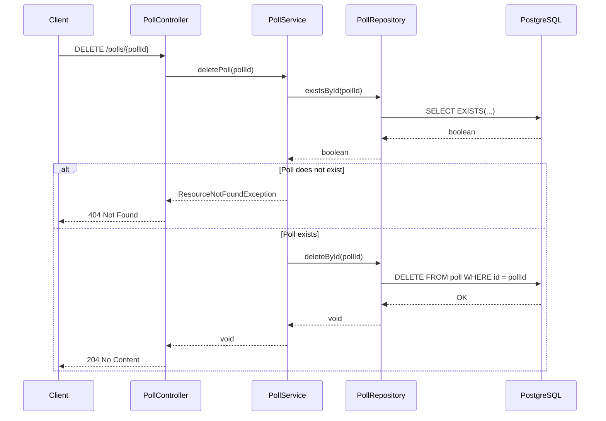
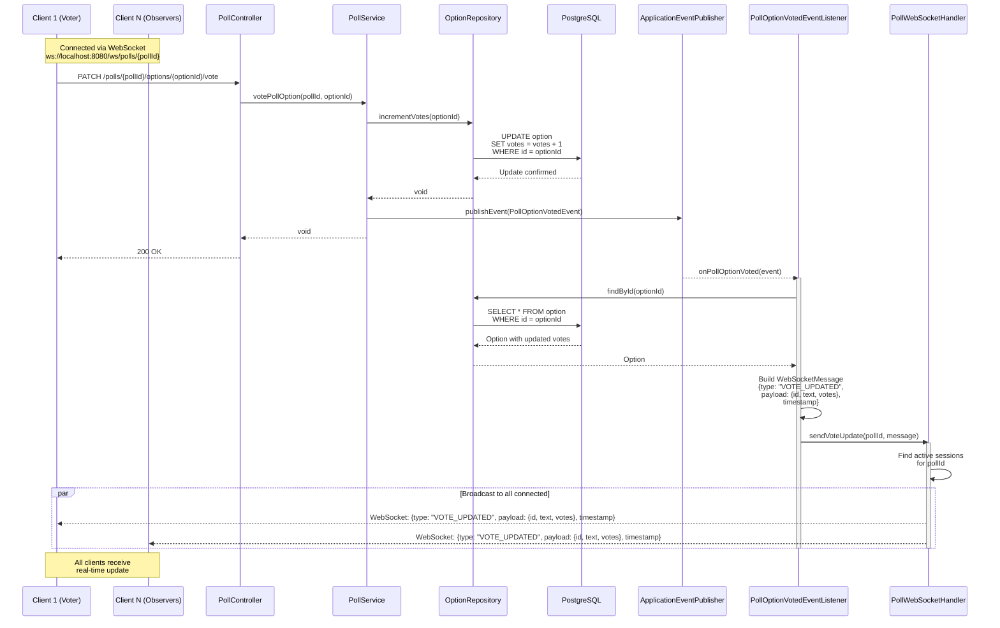

# Real-Time Polls System

> [!NOTE]
> This project was developed based on a **public LinkedIn challenge** and is here for study reference only.  
> I did not participate in any selection process related to it.  
> Original source: [LinkedIn](https://www.linkedin.com/feed/update/urn:li:activity:7387095489164492800/)

> **🇧🇷 Leia a versão em Português aqui: [README_pt-br.md](./docs/README_pt-br.md)**

## About the Project

This repository presents a **real-time polls system** developed as a solution for a technical challenge.

> See all challenge requirements in this [document](./docs/challenge.md).

## Features

- **Create** Polls
- **Edit** Polls
- **Delete** Polls
- **Paginate** Polls with Filters
- **Add** and **Remove** Poll Options
- **Real-Time Voting** with WebSocket

## Stack

- **Java 25:** Main backend language.
- **Spring Boot:** Framework for building APIs and backend services.
- **Spring Data JPA:** Spring ORM for abstracting database access using Java entities.
- **Spring WebSocket:** Spring library implementing the WebSocket protocol.
- **Flyway:** Database table versioning library.
- **Lombok:** Boilerplate reduction library.
- **Bean Validation:** Data validation library.
- **Testcontainers:** Library for testing with Docker containers.
- **JUnit:** Testing framework.
- **PostgreSQL:** Relational database.
- **Docker Compose:** Container management tool.
- **Swagger:** API documentation.

## Architecture and Design

> [!IMPORTANT]
> Code snippets and diagrams are simplified for direct understanding.
> Details like **validation**, **error handling**, and **transactions** may be omitted.
> The goal is to highlight main flows and architectural decisions.

### Layered Architecture

```text
┌─────────────────────────────────────┐
│         Controllers                 │ ← Application Layer
├─────────────────────────────────────┤
│          Services                   │ ← Business Layer
├─────────────────────────────────────┤
│        Repositories                 │ ← Data Access Layer
├─────────────────────────────────────┤
│          Database                   │ ← Data Layer
└─────────────────────────────────────┘
```

The application follows the **layered architecture** pattern, separating responsibilities for cleaner and more modular code:

- **Application Layer:** Handles HTTP requests and WebSocket connections.
- **Business Layer:** Contains business logic.
- **Data Access Layer:** Abstracts data access.
- **Data Layer:** Where data is actually stored.

#### Example Flow Between Layers

##### DELETE /polls/{pollId} - Delete Poll



### Event-Driven Architecture

The application uses an **event-driven architecture**, implemented with **Spring Events**, to ensure **decoupling between components**.
This approach allows the Controller to only respond to the request, while client notification occurs **asynchronously** and **independently**.



#### Event Architecture Components

1. **PollOptionVotedEvent**
    - Represents the event published after a vote is registered.
    - Contains: `pollId`, `optionId`, and `timestamp`.
    - Responsible for **transporting event data**, without depending on notification logic.
   ```java
    @Getter
    public class PollOptionVotedEvent extends ApplicationEvent {

        private final String pollId;
        private final String optionId;
        private final Instant eventTimestamp;

        public PollOptionVotedEvent(Object source, String pollId, String optionId, Instant eventTimestamp) {
            super(source);
            this.pollId = pollId;
            this.optionId = optionId;
            this.eventTimestamp = eventTimestamp;
        }
    }
    ```

2. **PollOptionVotedEventListener**
    - Listens to published events and processes them in the background (`@Async`).
    - Runs in a new transaction (`REQUIRES_NEW`) for consistent reading.
    - Transaction is marked as read-only (`readOnly = true`) for performance.
    - Retrieves updated data and sends the WebSocket message.
    ```java
    @Component
    @RequiredArgsConstructor
    public class PollOptionVotedEventListener {

        private final PollWebSocketHandler webSocketHandler;
        private final OptionRepository optionRepository;

        @Async
        @Transactional(propagation = REQUIRES_NEW, readOnly = true)
        @TransactionalEventListener
        public void onPollOptionVoted(PollOptionVotedEvent event) {
            var option = optionRepository.findById(event.getOptionId())
                    .orElseThrow();

            var message = new WebSocketMessage<>(
                    "VOTE_UPDATED",
                    new VoteUpdateMessage(option.getId(), option.getText(), option.getVotes()),
                    event.getEventTimestamp().toString()
            );

            webSocketHandler.sendVoteUpdate(event.getPollId(), message);
        }
    }
    ```

3. **PollWebSocketHandler**
    - Manages WebSocket connections for each poll (`pollId`).
    - Stores sessions in a **thread-safe** structure (`ConcurrentHashMap`).
    - Broadcasts only to clients interested in the specific poll.
    ```java
    @Component
    @Slf4j
    @RequiredArgsConstructor
    public class PollWebSocketHandler extends TextWebSocketHandler {

        private final ObjectMapper objectMapper;

        private final Map<String, CopyOnWriteArraySet<WebSocketSession>> pollSessions = new ConcurrentHashMap<>();

        // Other connection/disconnection methods omitted for brevity

        public void sendVoteUpdate(String pollId, WebSocketMessage<?> message) {
            var sessions = pollSessions.get(pollId);
            if (sessions == null || sessions.isEmpty()) return;

            try {
                var json = objectMapper.writeValueAsString(message);
                var textMessage = new TextMessage(json);

                sessions.removeIf(session -> {
                    try {
                        if (session.isOpen()) {
                            session.sendMessage(textMessage);
                            return false;
                        }
                    } catch (Exception e) {
                        log.warn("Error sending message, removing session {}", session.getId());
                    }
                    return true;
                });

                log.info("Sent update to {} active sessions for poll {}", sessions.size(), pollId);
            } catch (Exception e) {
                log.error("Failed to send update for poll {}: {}", pollId, e.getMessage());
            }
        }
    }
    ```

#### Advantages of this Architecture

- **Decoupling**: Controller and WebSocket do not know each other directly
- **Performance**: Voting responds quickly and broadcast is done in parallel
- **Scalability**: Events processed in separate threads
- **Resilience**: WebSocket failures do not affect voting flow
- **Maintainability**: Each component has a clear responsibility

### Data Transfer Object (DTO) Pattern

The **Data Transfer Object** isolates domain entities from the transport layer, ensuring security and clarity in API-client communication.

```java
@EndDateAfterStartDate
public record CreatePollRequest(
    @NotBlank(message = "Question cannot be blank")
    @Size(max = 2000, message = "Question cannot have more than 2000 characters")
    String question,

    @FutureOrPresent(message = "Poll cannot start in the past")
    OffsetDateTime startsAt,

    @FutureOrPresent(message = "Poll cannot end in the past")
    OffsetDateTime endsAt,

    @Size(min = 3, message = "Poll must have at least 3 options")
    List<@NotBlank(message = "Poll option cannot be blank") String> options
) {}

@RestController
public class PollController {
    // Omitted for brevity
    @PostMapping("/polls")
    public ResponseEntity<CreatePollResponse> createPoll(
            @RequestBody @Valid CreatePollRequest request // Declarative validation with Bean Validation
    ) {}
}
```

- Ensures separation between domain entities and transport objects.
- Uses **Java Records** for immutability.
- Applies **declarative validation** with **Bean Validation**.

### Key Technical Decisions

#### Poll Status Calculated Dynamically

```java
public class Poll {
    private Instant startsAt;
    private Instant endsAt;

    public PollStatus getStatus() {
        Instant now = Instant.now();
        if (now.isBefore(startsAt)) return PollStatus.NOT_STARTED;
        if (now.isAfter(endsAt) || now.equals(endsAt)) return PollStatus.FINISHED;
        return PollStatus.IN_PROGRESS;
    }
}
```
- **Problem:** Persisting poll status in the database can cause divergence whenever `startsAt` or `endsAt` are changed. It would also require scheduled tasks (cron jobs) to update status as time advances.
- **Solution:** Poll status is calculated from start and end dates.
- **Benefits:**
    - Completely removes the need for cron jobs or sync routines.
    - Poll state always consistent.
    - Simpler business logic.

#### Asynchronous Event Processing

```java
public class PollOptionVotedEventListener {
    @Async
    @TransactionalEventListener
    public void onPollOptionVoted(PollOptionVotedEvent event) {
        // Processes event and notifies via WebSocket
    }
}
```
- **Problem:** If WebSocket notification ran inside the HTTP request, any broadcast slowness would impact vote response time.
- **Solution:** Event is captured and processed asynchronously via `@Async` and `@TransactionalEventListener`.
- **Benefits:**
    - HTTP request responds quickly after registering the vote.
    - Better throughput under high load.
    - WebSocket decoupled from voting logic.
- Asynchronous event processing avoids request thread blocking, improving application responsiveness.

#### Pessimistic Lock for Concurrency

```java
@Repository
public interface PollRepository extends JpaRepository<Poll, String> {
    @Lock(PESSIMISTIC_WRITE)
    Optional<Poll> findByIdWithLock(String pollId);
}
```

- **Problem:** Simultaneous operations involving option removal may violate the “minimum 3 options per poll” rule.
- **Solution:** Use **pessimistic lock** to ensure exclusivity during write operations.
- **Benefits:**
    - Strong transactional consistency even under multiple concurrent requests.
    - Eliminates race conditions in write operations.
- **Trade-offs:**
    - May increase wait time under high concurrency.
    - Lower throughput in scenarios with many simultaneous writes.

#### Virtual Threads

```yaml
spring:
  threads:
    virtual:
      enabled: true
```

```java
@EnableAsync
@Configuration
public class AsyncConfig implements AsyncConfigurer {
    @Override
    public Executor getAsyncExecutor() {
        ThreadPoolTaskExecutor executor = new ThreadPoolTaskExecutor();
        executor.setVirtualThreads(true);
        executor.setCorePoolSize(100);
        executor.setMaxPoolSize(10000);
        executor.setQueueCapacity(100000);
        executor.setThreadNamePrefix("async-event-");
        executor.initialize();
        return executor;
    }
}
```

- **Problem:** Platform threads (OS) scale poorly with many blocking I/O operations.
- **Solution:** Enable **Virtual Threads** for the async executor and requests.
- **Benefits:**
    - Simple to enable
    - High concurrency with low memory cost.
    - Keeps blocking I/O model, but with scalability close to reactive solutions.
    - Reduces thread management complexity.
- **Trade-offs:**
    - Not ideal for CPU-bound workloads.
    - Requires Java 21+.

## API Documentation

### Swagger

Full API documentation is available via Swagger UI:

[//]: # (- Online: [https://smlaurindo.github.io/realtime-polls-challenge/swagger-ui.html]&#40;https://smlaurindo.github.io/realtime-polls-challenge/swagger-ui/index.html?urls.primaryName=Portugu%C3%AAs+%28Brasil%29&#41;)
- Locally: [http://localhost:8080/swagger-ui.html](http://localhost:8080/swagger-ui/index.html?urls.primaryName=English)

### Main Endpoints

#### Create Poll
```http
POST /polls
Content-Type: application/json

{
  "question": "What is your favorite programming language?",
  "startsAt": "2025-11-13T10:00:00Z",
  "endsAt": "2025-11-20T10:00:00Z",
  "options": ["Java", "Python", "JavaScript", "Go"]
}
```

#### List Polls (with filter)
```http
GET /polls?status=IN_PROGRESS&page=0&size=20&sort=startsAt,desc
```

#### Edit Poll
```http
PUT /polls/{pollId}
Content-Type: application/json

{
  "question": "What is your favorite language? (updated)",
  "startsAt": "2025-11-14T10:00:00Z",
  "endsAt": "2025-11-21T10:00:00Z"
}
```

#### Add Option
```http
POST /polls/{pollId}/options
Content-Type: application/json

{
  "text": "Rust"
}
```

#### Vote
```http
PATCH /polls/{pollId}/options/{optionId}/vote
```

#### Delete Option
```http
DELETE /polls/{pollId}/options/{optionId}
```

#### Delete Poll
```http
DELETE /polls/{pollId}
```

### WebSocket

#### Connect

```javascript
// Replace host and port as needed
// Replace {pollId} with the actual poll ID
const wsURL = 'ws://localhost:8080/ws/polls/{pollId}';

const ws = new WebSocket(wsURL);

ws.onmessage = (event) => {
  const message = JSON.parse(event.data);
  console.log('Vote updated:', message);
};
```

#### Vote Message

```json
{
  "type": "VOTE_UPDATED",
  "payload": {
    "id": "option-uuid",
    "text": "Java",
    "votes": 42
  },
  "timestamp": "2025-11-12T15:30:00Z"
}
```

## Tests

Automated tests cover all main application features, ensuring robustness and reliability.
All business rules were validated through **end-to-end tests** on controllers.

### Implemented Tests

Tests were implemented using the following technologies:

- **Testcontainers:** Real PostgreSQL dynamically generated via container for test execution
- **WebTestClient:** Spring WebFlux REST test client for HTTP requests
- **WebSocketClient:** Spring WebSocket client
- **JUnit 5:** Test library

#### Poll Creation (`CreatePollTests`)

- **Create** poll with valid data
- **Fail** with blank question
- **Fail** with less than 3 options
- **Fail** with start date in the past

#### Poll Listing (`ListPollsTests`)

- **List** all polls with pagination
- **List** all polls filtering by status `NOT_STARTED`
- **List** all polls filtering by status `IN_PROGRESS`
- **List** all polls filtering by status `FINISHED`

#### Poll Editing (`EditPollTests`)

- **Edit** poll not started
- **Fail** when trying to edit started poll
- **Fail** when trying to edit finished poll

#### Add Option to Poll (`AddPollOptionTests`)

- **Add** option to poll not started
- **Fail** when trying to add option to started poll
- **Fail** when trying to add blank option

#### Vote in a Poll (`VotePollOptionTests`)

- **Vote** in poll in progress
- **Notify** votes via WebSocket
- **Fail** when voting in poll not started
- **Fail** when voting in finished poll
- **Fail** when voting in non-existent poll
- **Increment** votes correctly under concurrency

#### Delete Option from Poll (`DeletePollOptionTests`)

- **Delete** option from poll not started
- **Fail** when trying to delete option if poll has only 3 options or less
- **Fail** when deleting option from started poll
- **Fail** when deleting option from non-existent poll

#### Delete Poll (`DeletePollTests`)

- **Delete** existing poll
- **Delete** poll options correctly when poll is deleted
- **Fail** when trying to delete non-existent poll

## Data Model

### Logical Modeling

Logical modeling is the abstract representation of system data, without worrying about database specifics.
It defines entities, their attributes, and relationships. The model is described as follows:

> [!NOTE]
> All `id` fields are UUIDv4 as described in the [challenge](./docs/challenge.md) requirements.

```text
┌─────────────────────────┐
│        POLLS            │
├─────────────────────────┤
│ id         TEXT         │◄──┐
│ question   TEXT         │   │
│ starts_at  DATETIME     │   │
│ ends_at    DATETIME     │   │
└─────────────────────────┘   │
                              │
                              │ 1:N
                              │
┌─────────────────────────┐   │
│       OPTIONS           │   │
├─────────────────────────┤   │
│ id         TEXT         │   │
│ text       TEXT         │   │
│ votes      INTEGER      │   │
│ poll_id    TEXT         ├───┘
└─────────────────────────┘
```

- **Poll:** Represents a poll.
    - **id:** Unique poll identifier
    - **question:** Poll question
    - **starts_at:** Poll start date and time
    - **ends_at:** Poll end date and time
- **Options:** Represents poll answer options.
    - **id:** Unique option identifier
    - **text:** Option text
    - **votes:** Number of votes received by the option
    - **poll_id:** Poll identifier to which the option belongs

### Physical Modeling

Physical modeling translates logical modeling to a specific database implementation.
It involves defining data types, indexes, constraints, and other database details.
Physical modeling for this project, using PostgreSQL, is implemented with the following SQL:

> [!NOTE]
> You can also view the DDL in this [file](./src/main/resources/db/migration/V1__create_polls_and_options.sql).

```sql
CREATE TABLE polls(
   id        VARCHAR(255) NOT NULL,
   question  TEXT NOT NULL,
   starts_at TIMESTAMPTZ NOT NULL,
   ends_at   TIMESTAMPTZ NOT NULL,
   CONSTRAINT polls_pk_id PRIMARY KEY (id)
);

CREATE TABLE options(
   id      VARCHAR(255) NOT NULL,
   text    TEXT NOT NULL,
   votes   INTEGER NOT NULL DEFAULT 0,
   poll_id VARCHAR(255) NOT NULL,
   CONSTRAINT options_pk_id PRIMARY KEY (id),
   CONSTRAINT options_fk_poll FOREIGN KEY (poll_id) REFERENCES polls (id) ON DELETE CASCADE
);

CREATE INDEX options_idx_fk_poll ON options(poll_id);
```

#### Considerations

To keep the database consistent and efficient, the following practices were adopted:

- **Referential Integrity**: Foreign keys ensure table relationships are respected. If a poll is deleted, associated options are deleted according to `CASCADE` rules.
- **Indexes**: Indexes on foreign and primary keys improve query performance.
- **Normalization**: Table structure follows normalization rules, minimizing redundancy and ensuring data consistency.

## Frontend

This project has a simple web frontend to interact with the API and demonstrate real-time voting functionality.

Frontend features include:

- **Poll Listing:** View all available polls
- **Real-Time Updates:** See votes happening live
- **Interactive Voting:** Vote with one click
- **Connection Status:** Visual WebSocket indicator
- **Responsive Design:** Clean and modern interface

### Frontend Technologies

For simplicity, the frontend was developed without frameworks, using only native web technologies:

- HTML5
- CSS3
- Vanilla JavaScript (no frameworks)
- Native WebSocket API
- Fetch API for REST API consumption

## Installation

If you want to run the project locally, follow the steps below:

### Prerequisites

- **Java 25+**
- **Docker** and **Docker Compose**
- **Gradle**

### Steps

#### 1. Clone the repository

```bash
git clone https://github.com/smlaurindo/realtime-polls-challenge.git && cd realtime-polls-challenge
```

#### 2. Configure environment variables

Copy the example file and adjust as needed:

```shell
cp .env.example .env
```

```env
SERVER_PORT=8080

POSTGRES_USER=realtime_poll_db_user
POSTGRES_PASSWORD=realtime_poll_db_password
POSTGRES_DB=realtime_poll_db
POSTGRES_PORT=5432

CORS_ALLOWED_ORIGINS=http://localhost:3000,http://localhost:8080
```

#### 3. Start the database

> [!IMPORTANT]
> PostgreSQL will be started using the `POSTGRES` variables from the `.env` file.
> Adminer will also be started for database management, accessible at `http://localhost:8081`.
> Since Adminer is on the same network as PostgreSQL, the database host will be `postgres` instead of `localhost`.

```bash
docker-compose up -d
```

#### 4. Run the application

##### 4.1. On Windows

On Windows, there is no native command to load all variables from the `.env` file automatically. Use a batch script like below:

```shell
@echo off
for /f "usebackq tokens=1,* delims==" %%A in (".env") do (
  if not "%%A"=="" set %%A=%%B
)
.\gradlew.bat bootRun
```

##### 4.2. On Linux/Mac

```shell
export $(grep -v '^#' .env | xargs) # This command loads the .env
./gradlew bootRun
```

#### 5. Access the application

- **Frontend:** http://localhost:8080/index.html
- **Swagger UI:** http://localhost:8080/swagger-ui.html
- **Adminer:** http://localhost:8081

## Author

Developed by **Samuel Laurindo**

- Email: contato.samuellaurindo@gmail.com
- LinkedIn: https://linkedin.com/in/smlaurindo
- GitHub: https://github.com/smlaurindo

## License

> [!WARNING]
> Pull requests will not be accepted in this repository, as it is for study and reference only.

This project is under the MIT license. There are no restrictions for use, modification, or distribution. See the [LICENSE](./LICENSE) file for more details.
