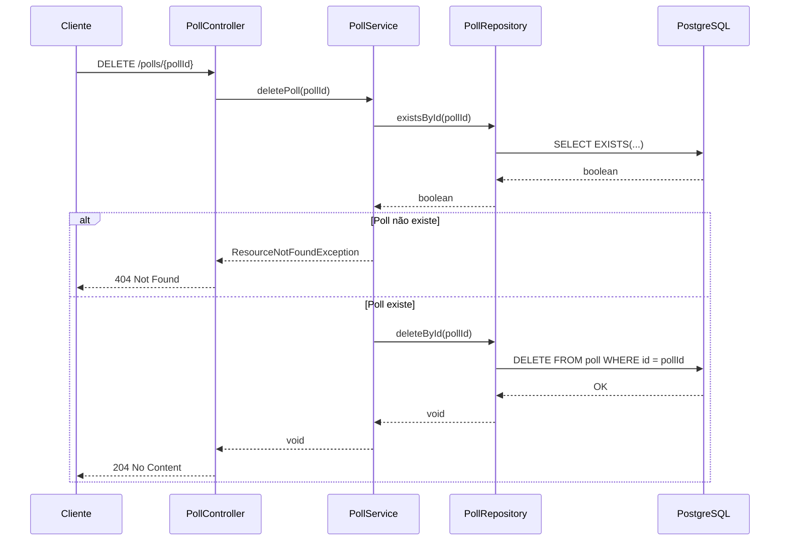
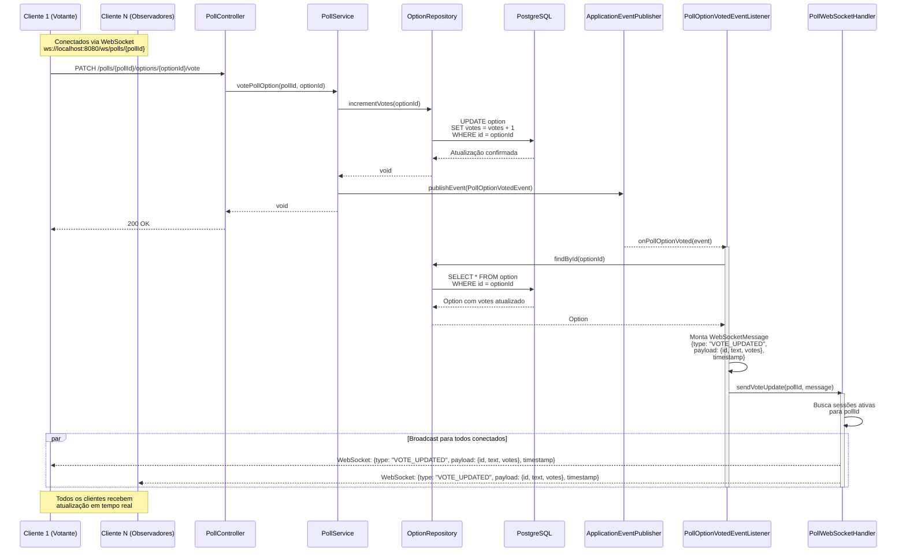

# Sistema de Enquetes em Tempo Real

> [!NOTE]  
> Este projeto foi desenvolvido com base em um **desafio público no LinkedIn** e está aqui apenas como referência de estudo.  
> Não participei de nenhum processo seletivo relacionado a ele.  
> Fonte original: [LinkedIn](https://www.linkedin.com/feed/update/urn:li:activity:7387095489164492800/)

## Sobre o Projeto

Este repositório apresenta um sistema de **enquetes em tempo real** desenvolvido como solução para um desafio técnico.  

> Veja todos os requisitos do desafio nesse [documento](./challenge_pt-br.md).

## Funcionalidades

- **Criação** de Enquetes
- **Edição** de Enquetes
- **Exclusão** de Enquetes
- **Paginação** de Enquetes com Filtros
- **Adição** e **Remoção** de Opções das Enquetes
- **Votação em Tempo Real** com WebSocket

## Stack

- **Java 25:** Linguagem principal usada no backend.
- **Spring Boot:** Framework para construir APIs e serviços de backend.
- **Spring Data JPA:** ORM do Spring para abstrair o acesso ao banco de dados usando entidades Java.
- **Spring WebSocket:** Biblioteca do Spring que implementa o protocolo WebSocket.
- **Flyway:** Biblioteca para controle de versionamento de tabelas do banco de dados.
- **Lombok:** Biblioteca para redução de boilerplate.
- **Bean Validation:** Biblioteca de validação de dados.
- **Testcontainers:** Biblioteca para testes com containers Docker.
- **JUnit:** Framework de testes.
- **PostgreSQL:** Banco de dados relacional.
- **Docker Compose:** Ferramenta de gerenciamento de containers.
- **Swagger:** Documentação da API.

## Arquitetura e Design

> [!IMPORTANT]  
> Os snippets de código e diagramas foram simplificados para deixar a compreensão mais direta.  
> Detalhes como **validações**, **tratamento de erros** e **transações** podem ser omitidos.  
> O objetivo é destacar os principais fluxos e decisões de arquitetura.

### Layered Architecture

```text
┌─────────────────────────────────────┐
│         Controllers                 │ ← Camada de Aplicação
├─────────────────────────────────────┤
│          Services                   │ ← Camada de Negócio
├─────────────────────────────────────┤
│        Repositories                 │ ← Camada de Acesso a Dados
├─────────────────────────────────────┤
│          Database                   │ ← Camada de Dados
└─────────────────────────────────────┘
```

A aplicação segue o padrão de **arquitetura em camadas**, separando responsabilidades para manter o código mais limpo e modular:

- **Camada de Aplicação:** Responsável por receber as requisições HTTP e conexões WebSocket.
- **Camada de Negócio:** Contém a lógica de negócio.
- **Camada de Acesso a Dados:** Responsável por abstrair o acesso aos dados.
- **Camada de Dados:** Onde os dados são efetivamente armazenados.

#### Exemplo de Fluxo entre as Camadas

##### DELETE /polls/{pollId} - Deletar Enquete



### Event-Driven Architecture

A aplicação utiliza uma arquitetura **orientada a eventos**, implementada com **Spring Events**, para garantir **desacoplamento entre componentes**.
Essa abordagem permite que o Controller apenas responda a requisição, enquanto a notificação aos clientes ocorre de forma **assíncrona** e **independente**.



#### Componentes da Arquitetura de Eventos

1. **PollOptionVotedEvent**
   - Representa o evento publicado após o registro de um voto.
   - Contém: `pollId`, `optionId` e `timestamp`.
   - É responsável por **transportar os dados do evento**, sem depender da lógica de notificação.
   ```java
    @Getter
    public class PollOptionVotedEvent extends ApplicationEvent {
    
        private final String pollId;
        private final String optionId;
        private final Instant eventTimestamp;
    
        public PollOptionVotedEvent(Object source, String pollId, String optionId, Instant eventTimestamp) {
            super(source);
            this.pollId = pollId;
            this.optionId = optionId;
            this.eventTimestamp = eventTimestamp;
        }
    }
    ```

2. **PollOptionVotedEventListener**
    - Escuta eventos publicados e os processa em background (`@Async`).
    - É executado em nova transação (`REQUIRES_NEW`) para garantir leitura consistente.
    - A transação é marcada como somente leitura (`readOnly = true`) para otimizar performance.
    - Recupera os dados atualizados e envia a mensagem WebSocket.
    ```java
    @Component
    @RequiredArgsConstructor
    public class PollOptionVotedEventListener {
    
        private final PollWebSocketHandler webSocketHandler;
        private final OptionRepository optionRepository;
    
        @Async
        @Transactional(propagation = REQUIRES_NEW, readOnly = true)
        @TransactionalEventListener
        public void onPollOptionVoted(PollOptionVotedEvent event) {
            var option = optionRepository.findById(event.getOptionId())
                    .orElseThrow();
    
            var message = new WebSocketMessage<>(
                    "VOTE_UPDATED",
                    new VoteUpdateMessage(option.getId(), option.getText(), option.getVotes()),
                    event.getEventTimestamp().toString()
            );
    
            webSocketHandler.sendVoteUpdate(event.getPollId(), message);
        }
    }
    ```

3. **PollWebSocketHandler**
    - Gerencia as conexões WebSocket de cada enquete (`pollId`).
    - Armazena sessões em uma estrutura **thread-safe** (`ConcurrentHashMap`).
    - Faz broadcast apenas para os clientes interessados na enquete específica.
    ```java
    @Component
    @Slf4j
    @RequiredArgsConstructor
    public class PollWebSocketHandler extends TextWebSocketHandler {

        private final ObjectMapper objectMapper;

        private final Map<String, CopyOnWriteArraySet<WebSocketSession>> pollSessions = new ConcurrentHashMap<>();

        // Outros métodos de conexão e desconexão omitidos para brevidade

        public void sendVoteUpdate(String pollId, WebSocketMessage<?> message) {
            var sessions = pollSessions.get(pollId);
            if (sessions == null || sessions.isEmpty()) return;

            try {
                var json = objectMapper.writeValueAsString(message);
                var textMessage = new TextMessage(json);

                sessions.removeIf(session -> {
                    try {
                        if (session.isOpen()) {
                            session.sendMessage(textMessage);
                            return false;
                        }
                    } catch (Exception e) {
                        log.warn("Erro ao enviar mensagem, removendo sessão {}", session.getId());
                    }
                    return true;
                });

                log.info("Enviada atualização para {} sessões ativas da enquete {}", sessions.size(), pollId);
            } catch (Exception e) {
                log.error("Falha ao enviar atualização para enquete {}: {}", pollId, e.getMessage());
            }
        }
    }
    ```

#### Vantagens dessa Arquitetura

- **Desacoplamento**: Controller e WebSocket não se conhecem diretamente
- **Performance**: A votação responde rápido e o broadcast é feito em paralelo
- **Escalabilidade**: Eventos processados em threads separadas
- **Resiliência**: Falhas no WebSocket não afetam o fluxo de votação
- **Manutenibilidade**: Cada componente tem uma responsabilidade clara

### Data Transfer Object (DTO) Pattern

O **Data Transfer Object** isola as entidades de domínio da camada de transporte, garantindo segurança e clareza na comunicação entre API e cliente.

```java
@EndDateAfterStartDate
public record CreatePollRequest(
    @NotBlank(message = "A questão não pode estar em branco")
    @Size(max = 2000, message = "A questão não pode ter mais de 2000 caracteres")
    String question,

    @FutureOrPresent(message = "A enquete não pode começar no passado")
    OffsetDateTime startsAt,

    @FutureOrPresent(message = "A enquete não pode terminar no passado")
    OffsetDateTime endsAt,

    @Size(min = 3, message = "A enquete deve ter no mínimo 3 opções")
    List<@NotBlank(message = "A opção da enquete não pode estar em branco") String> options
) {}

@RestController
public class PollController {
    // Omitido para brevidade
    @PostMapping("/polls")
    public ResponseEntity<CreatePollResponse> createPoll(
            @RequestBody @Valid CreatePollRequest request // Validação declarativa com Bean Validation
    ) {}
}
```

- Garante separação entre entidades de domínio e objetos de transporte.
- Utiliza **Java Records** para garantir imutabilidade.
- Aplica **validação declarativa** com **Bean Validation**.

### Decisões Técnicas Importantes

#### Status da Enquete Calculado Dinamicamente

```java
public class Poll {
    private Instant startsAt;
    private Instant endsAt;
    
    public PollStatus getStatus() {
        Instant now = Instant.now();
        if (now.isBefore(startsAt)) return PollStatus.NOT_STARTED;
        if (now.isAfter(endsAt) || now.equals(endsAt)) return PollStatus.FINISHED;
        return PollStatus.IN_PROGRESS;
    }
}
```
- **Problema:** Persistir o status da enquete no banco pode gerar divergências sempre que `startsAt` ou `endsAt` forem alterados. Também exigiria tarefas agendadas (cron jobs) para atualizar o status conforme o tempo avança.
- **Solução:** O status da enquete é calculado a partir das datas de início e término. 
- **Benefícios:** 
  - Remoção completa da necessidade de cron jobs ou rotinas de sincronização.
  - Estado da enquete sempre consistente.
  - Simplicidade na lógica de negócio.

#### Processamento Assíncrono de Eventos

```java
public class PollOptionVotedEventListener {
    @Async
    @TransactionalEventListener
    public void onPollOptionVoted(PollOptionVotedEvent event) {
        // Processa evento e notifica via WebSocket
    }
}
```
- **Problema:** Se a notificação WebSocket fosse executada dentro da requisição HTTP, qualquer lentidão no broadcast impactaria o tempo de resposta do voto.
- **Solução:** O evento é capturado e processado de forma assíncrona via `@Async` e `@TransactionalEventListener`.
- **Benefícios:**
  - A requisição HTTP responde rapidamente após registrar o voto.
  - Melhor throughput sob carga alta.
  - WebSocket desacoplado da lógica de votação.
- Processar o evento assincronamente evita bloqueios na thread de requisição, melhorando a responsividade da aplicação.

#### Lock Pessimista para Concorrência

```java
@Repository
public interface PollRepository extends JpaRepository<Poll, String> {
    @Lock(PESSIMISTIC_WRITE)
    Optional<Poll> findByIdWithLock(String pollId);
}
```

- **Problema:** Operações simultâneas envolvendo remoção de opções podem violar a regra de “mínimo de 3 opções por enquete”.
- **Solução:** Utilização de **lock pessimista** para garantir exclusividade durante operações de escrita.
- **Benefícios:**
  - Forte consistência transacional mesmo sob múltiplas requisições concorrentes.
  - Elimina race conditions em operações de escrita.
- **Trade-offs:**
  - Pode aumentar o tempo de espera sob alta concorrência.
  - Menor throughput em cenários com muitos writes simultâneos.

#### Virtual Threads

```yaml
spring:
  threads:
    virtual:
      enabled: true
```

```java
@EnableAsync
@Configuration
public class AsyncConfig implements AsyncConfigurer {
    @Override
    public Executor getAsyncExecutor() {
        ThreadPoolTaskExecutor executor = new ThreadPoolTaskExecutor();
        executor.setVirtualThreads(true);
        executor.setCorePoolSize(100);
        executor.setMaxPoolSize(10000);
        executor.setQueueCapacity(100000);
        executor.setThreadNamePrefix("async-event-");
        executor.initialize();
        return executor;
    }
}
```

- **Problema:** As threads de plataforma (sistema operacional) escalam mal quando há muitas operações bloqueantes de I/O.
- **Solução:** Ativar **Virtual Threads** para o executor assíncrono e para requisições.
- **Benefícios:**
  - Simples de ativar
  - Alto nível de concorrência com baixo custo de memória.
  - Mantém o modelo blocking I/O, mas com escalabilidade próxima de soluções reativas.
  - Redução da complexidade na gestão de threads.
- **Trade-offs:**
  - Não é ideal para cargas de trabalho CPU-bound.
  - Requer Java 21+.

## Documentação da API

### Swagger

A documentação completa da API está disponível via Swagger UI:

[//]: # (- Online: [https://smlaurindo.github.io/realtime-polls-challenge/swagger-ui.html]&#40;https://smlaurindo.github.io/realtime-polls-challenge/swagger-ui/index.html?urls.primaryName=Portugu%C3%AAs+%28Brasil%29&#41;)
- Localmente: [http://localhost:8080/swagger-ui.html](http://localhost:8080/swagger-ui/index.html?urls.primaryName=Portugu%C3%AAs+%28Brasil%29)

### Endpoints Principais

#### Criar Enquete
```http
POST /polls
Content-Type: application/json

{
  "question": "Qual sua linguagem de programação favorita?",
  "startsAt": "2025-11-13T10:00:00Z",
  "endsAt": "2025-11-20T10:00:00Z",
  "options": ["Java", "Python", "JavaScript", "Go"]
}
```

#### Listar Enquetes (com filtro)
```http
GET /polls?status=IN_PROGRESS&page=0&size=20&sort=startsAt,desc
```

#### Obter Enquete
```http
GET /polls/{pollId}
```

#### Editar Enquete
```http
PUT /polls/{pollId}
Content-Type: application/json

{
  "question": "Qual sua linguagem favorita? (atualizada)",
  "startsAt": "2025-11-14T10:00:00Z",
  "endsAt": "2025-11-21T10:00:00Z"
}
```

#### Adicionar Opção
```http
POST /polls/{pollId}/options
Content-Type: application/json

{
  "text": "Rust"
}
```

#### Votar
```http
PATCH /polls/{pollId}/options/{optionId}/vote
```

#### Deletar Opção
```http
DELETE /polls/{pollId}/options/{optionId}
```

#### Deletar Enquete
```http
DELETE /polls/{pollId}
```

### WebSocket

#### Conectar

```javascript
// Substitua host e porta conforme necessário
// Substitua {pollId} pelo ID real da enquete
const wsURL = 'ws://localhost:8080/ws/polls/{pollId}';

const ws = new WebSocket(wsURL);

ws.onmessage = (event) => {
  const message = JSON.parse(event.data);
  console.log('Voto atualizado:', message);
};
```

#### Mensagem de Voto

```json
{
  "type": "VOTE_UPDATED",
  "payload": {
    "id": "option-uuid",
    "text": "Java",
    "votes": 42
  },
  "timestamp": "2025-11-12T15:30:00Z"
}
```

## Testes

Os testes automatizados cobrem todas as funcionalidades principais da aplicação, garantindo robustez e confiabilidade.  
Todas as regras de negócio foram validadas através de **testes de ponta a ponta** nos controllers.

### Testes Implementados

Os testes foram implementados usando as seguintes tecnologias:

- **Testcontainers:** PostgreSQL real gerado dinamicamente via container para execução dos testes
- **WebTestClient:** Cliente REST de testes do Spring WebFlux para requisições HTTP
- **WebSocketClient:** Cliente de WebSocket do Spring
- **JUnit 5:** Biblioteca de testes

#### Criação de Enquetes (`CreatePollTests`) 

- **Criar** enquete com dados válidos
- **Falhar** com pergunta em branco
- **Falhar** com menos de 3 opções
- **Falhar** com data de início no passado

#### Listagem de Enquetes (`ListPollsTests`)

- **Listar** todas as enquetes com paginação
- **Listar** todas as enquetes filtrando por status `NOT_STARTED`
- **Listar** todas as enquetes filtrando por status `IN_PROGRESS`
- **Listar** todas as enquetes filtrando por status `FINISHED`

#### Obtenção de Enquete (`GetPollTests`)

- **Obter** enquete existente
- **Falhar** ao tentar obter enquete inexistente

#### Edição de Enquetes (`EditPollTests`)

- **Editar** enquete não iniciada
- **Falhar** ao tentar editar enquete iniciada
- **Falhar** ao tentar editar enquete finalizada

#### Adicionar Opção a Enquete (`AddPollOptionTests`)

- **Adicionar** opção a enquete não iniciada
- **Falhar** ao tentar adicionar opção a enquete iniciada
- **Falhar** ao tentar adicionar opção em branco

#### Votar em uma enquete (`VotePollOptionTests`)

- **Votar** em enquete em andamento
- **Notificar** votos via WebSocket
- **Falhar** ao votar em enquete não iniciada
- **Falhar** ao votar em enquete finalizada
- **Falhar** ao votar em enquete inexistente
- **Incrementar** votos corretamente sob concorrência

#### Deletar Opção de uma Enquete (`DeletePollOptionTests`)

- **Deletar** opção de enquete não iniciada
- **Falhar** ao tentar deletar opção se a enquete tiver somente 3 opções ou menos
- **Falhar** ao deletar opção de enquete iniciada
- **Falhar** ao deletar opção de enquete não existente

#### Deletar uma Enquete (`DeletePollTests`)

- **Deletar** enquete existente
- **Deletar** corretamente as opções de uma enquete que foi deletada
- **Falhar** ao tentar deletar enquete inexistente

## Modelo de Dados

### Modelagem Lógica

A modelagem lógica é a representação abstrata dos dados de um sistema, sem se preocupar com detalhes específicos do banco de dados, 
ela define as entidades, os atributos dessas entidades e os relacionamentos entre elas. O modelo está descrito dessa forma:

> [!NOTE]
> Todos os campos `id` são UUIDv4 conforme descrito nos requisitos do [desafio](./challenge_pt-br.md).

```text
┌─────────────────────────┐
│        POLLS            │
├─────────────────────────┤
│ id         TEXT         │◄──┐
│ question   TEXT         │   │
│ starts_at  DATETIME     │   │
│ ends_at    DATETIME     │   │
└─────────────────────────┘   │
                              │
                              │ 1:N
                              │
┌─────────────────────────┐   │
│       OPTIONS           │   │
├─────────────────────────┤   │
│ id         TEXT         │   │
│ text       TEXT         │   │
│ votes      INTEGER      │   │
│ poll_id    TEXT         ├───┘
└─────────────────────────┘
```

- **Poll:** Representa uma enquete.
  - **id:** Identificador único da enquete
  - **question:** Pergunta da enquete
  - **starts_at:** Data e hora de início da enquete
  - **ends_at:** Data e hora de término da enquete
- **Options:** Representa as opções de resposta da enquete.
  - **id:** Identificador único da opção
  - **text:** Texto da opção
  - **votes:** Número de votos recebidos pela opção
  - **poll_id:** Identificador da enquete à qual a opção pertence

### Modelagem Física

A modelagem física traduz a modelagem lógica para uma implementação específica de um banco de dados. 
Ela envolve a definição de tipos de dados, índices, restrições e outras particularidades do banco de dados. 
A modelagem física para esse projeto, usando PostgreSQL, é implementada com o seguinte SQL:

> [!NOTE]
> Também é possível visualizar o DDL nesse [arquivo](../src/main/resources/db/migration/V1__create_polls_and_options.sql).

```sql
CREATE TABLE polls(
   id        VARCHAR(255) NOT NULL,
   question  TEXT NOT NULL,
   starts_at TIMESTAMPTZ NOT NULL,
   ends_at   TIMESTAMPTZ NOT NULL,
   CONSTRAINT polls_pk_id PRIMARY KEY (id)
);

CREATE TABLE options(
   id      VARCHAR(255) NOT NULL,
   text    TEXT NOT NULL,
   votes   INTEGER NOT NULL DEFAULT 0,
   poll_id VARCHAR(255) NOT NULL,
   CONSTRAINT options_pk_id PRIMARY KEY (id),
   CONSTRAINT options_fk_poll FOREIGN KEY (poll_id) REFERENCES polls (id) ON DELETE CASCADE
);

CREATE INDEX options_idx_fk_poll ON options(poll_id);
```

#### Considerações

Para manter o banco de dados consistente e eficiente, foram adotadas as seguintes práticas:

- **Integridade Referencial**: As chaves estrangeiras garantem que os relacionamentos entre as tabelas sejam respeitados. 
Se uma enquete for deletada, as opções associadas serão deletados em conformidade com as regras de `CASCADE`.
- **Índices**: Os índices nas chaves estrangeiras e primárias melhoram a performance das consultas.
- **Normalização**: A estrutura de tabelas segue as regras de normalização, minimizando a redundância e garantindo a consistência dos dados.

## Frontend

Esse projeto possui um frontend web simples para interagir com a API e demonstrar a funcionalidade de votação em tempo real.

As funcionalidades do frontend incluem:

- **Listagem de Enquetes:** Visualize todas as enquetes disponíveis
- **Atualização em Tempo Real:** Veja os votos acontecendo ao vivo
- **Votação Interativa:** Vote com um clique
- **Status de Conexão:** Indicador visual do WebSocket
- **Design Responsivo:** Interface limpa e moderna

### Tecnologias Frontend

Por simplicidade, o frontend foi desenvolvido sem frameworks, utilizando apenas tecnologias web nativas:

- HTML5
- CSS3
- JavaScript Vanilla (sem frameworks)
- WebComponents
- WebSocket API nativa
- Fetch API para consumo de REST APIs

## Instalação

Caso você queira rodar o projeto localmente, siga os passos abaixo:

### Pré-requisitos

- **Java 25+**
- **Docker** e **Docker Compose**
- **Gradle**

### Passos

#### 1. Clone o repositório

```bash
git clone https://github.com/smlaurindo/realtime-polls-challenge.git && cd realtime-polls-challenge
```

#### 2. Configure as variáveis de ambiente

Copie o arquivo de exemplo e ajuste conforme necessário:

```shell 
cp .env.example .env 
```

```env
SERVER_PORT=8080

POSTGRES_USER=realtime_poll_db_user
POSTGRES_PASSWORD=realtime_poll_db_password
POSTGRES_DB=realtime_poll_db
POSTGRES_PORT=5432

CORS_ALLOWED_ORIGINS=http://localhost:3000,http://localhost:8080
```

#### 3. Inicie o banco de dados

> [!IMPORTANT]  
> O banco de dados PostgreSQL será iniciado utilizando as configurações das variáveis com prefixo `POSTGRES` do arquivo `.env`.  
> Também será inicializado o Adminer para gerenciamento do banco, acessível em `http://localhost:8081`.  
> Lembre-se que o Adminer por estar na mesma rede do PostgreSQL, o host do banco de dados será `postgres` ao invés de `localhost`.

```bash
docker-compose up -d
```

#### 4. Execute a aplicação

##### 4.1. No Windows

No Windows, não existe um comando nativo para carregar todas as variáveis do arquivo `.env` automaticamente. Para isso, utilize um script em batch como abaixo:

```shell
@echo off
for /f "usebackq tokens=1,* delims==" %%A in (".env") do (
  if not "%%A"=="" set %%A=%%B
)
.\gradlew.bat bootRun
```

##### 4.2. No Linux/Mac

```shell
export $(grep -v '^#' .env | xargs) # Esse comando carrega o .env
./gradlew bootRun
```

#### 5. Acesse a aplicação

- **Frontend:** http://localhost:8080/index.html
- **Swagger UI:** http://localhost:8080/swagger-ui.html
- **Adminer:** http://localhost:8081

## Autor

Desenvolvido por **Samuel Laurindo**

- Email: contato.samuellaurindo@gmail.com
- LinkedIn: https://linkedin.com/in/smlaurindo
- GitHub: https://github.com/smlaurindo

## Licença

> [!WARNING]  
> Pull requests não serão aceitos neste repositório, pois ele é apenas para fins de estudo e referência.

Este projeto está sob a licença MIT. Não há restrições para uso, modificação ou distribuição. Veja o arquivo [LICENSE](../LICENSE) para mais detalhes.

